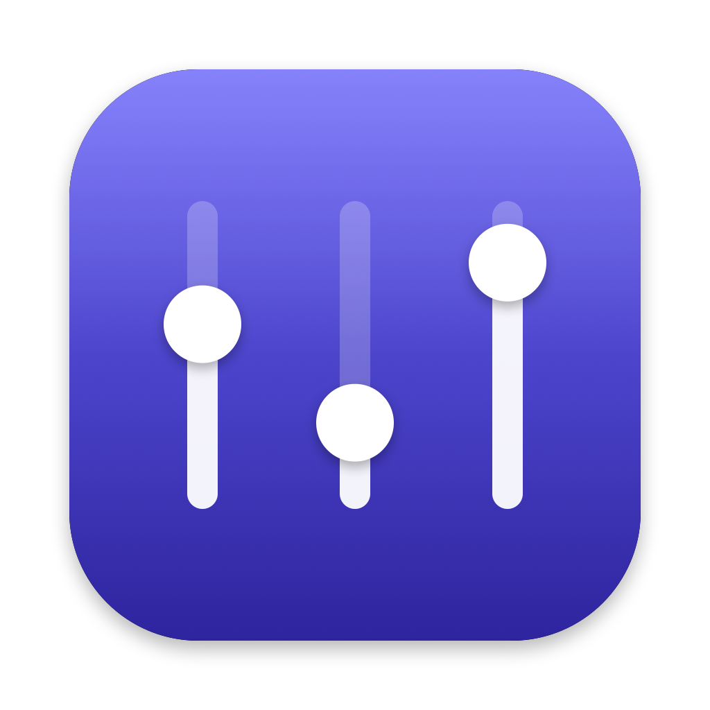
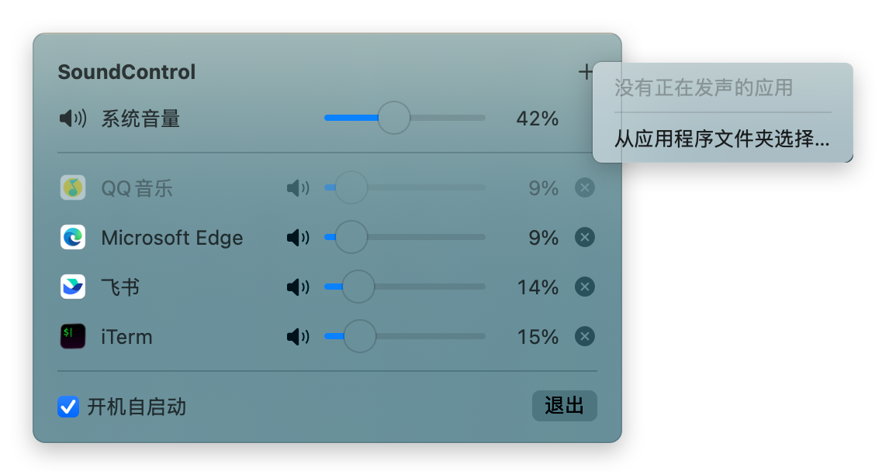

<p align="center">
  
</p>

<h1 align="center">SoundControl</h1>

<p align="center">常驻 macOS 菜单栏，为每个应用单独设置音量。</p>

<p align="center"><a href="README.md">English</a> | 简体中文</p>

---

macOS 只有一个统一的系统音量。SoundControl 让你把 Chrome 调到 30%、QQ音乐 保持 100%、微信提示音照旧——每个应用一条滑块，互不影响。

<p align="center">
  
</p>

## 功能

- **按应用调音量**：每个受控应用一条滑块（0–100%），并带独立的静音开关
- **随意添加**：从"正在发声"的应用中选，或从"应用程序"文件夹里预先添加未运行的应用
- **系统音量**：面板顶部直接调节当前输出设备的音量
- **自动跟随**：切换输出设备（扬声器 / AirPods / 显示器）后设置照常生效；应用重启后自动重新接管
- **只碰你添加的应用**：未添加的应用完全不受影响
- **开机自启动**
- 支持 Chrome、Safari 这类由多个辅助进程发声的应用

> **应用音量是相对值**：实际响度 = 系统音量 × 应用音量。系统音量 50%、某应用设为 50%，听到的就是 25%。

## 系统要求

- macOS 14.2 或更高版本（依赖 Core Audio Process Tap）
- Apple 芯片或 Intel 芯片的 Mac

## 下载安装

从 [Releases](https://github.com/luozhiyun993/SoundControl/releases/latest) 下载最新的 `SoundControl-x.y.z.dmg`，打开后把 **SoundControl** 拖进 **应用程序** 文件夹。

SoundControl 使用自签名证书，没有经过 Apple 公证，所以第一次打开会提示"无法验证开发者"。放行方法二选一：

- 打开 **系统设置 → 隐私与安全性**，滚动到底部，点击 SoundControl 旁边的 **仍要打开**
- 或在终端运行 `xattr -dr com.apple.quarantine /Applications/SoundControl.app`

第一次接管应用时，系统会请求 **系统音频录制** 权限，请允许。

## 从源码编译

需要 Xcode Command Line Tools（`xcode-select --install`），**不需要安装 Xcode**。

```bash
git clone https://github.com/luozhiyun993/SoundControl.git
cd SoundControl

# 1. 创建本地自签名代码签名证书（只需一次）
./scripts/create-signing-cert.sh

# 2. 编译并安装到 ~/Applications，然后启动
./scripts/install.sh
```

第一次签名时，钥匙串会询问是否允许 `codesign` 使用证书私钥，输入登录密码并点 **始终允许**。

第一次接管应用时，系统会请求 **系统音频录制** 权限，请允许。如果误点了拒绝，可以在面板里点"打开系统设置"重新授权。

> 为什么需要证书？如果用临时签名，每次重新编译后 macOS 都会把它当成新的 App，要求重新授权。

## 使用

1. **打开面板**：点击菜单栏的喇叭图标。
2. **添加应用**：点右上角 **＋**。菜单上半部分列出正在发声的应用，点一下即可添加；要添加还没打开的应用，选"从应用程序文件夹选择…"。
3. **调节**：
   - 拖动顶部的**系统音量**滑块，调节输出设备的音量。
   - 拖动某个应用的滑块，设置它相对系统音量的比例。
   - 点小喇叭图标静音或取消静音，滑块位置会保留。
   - 点 ⓧ 移除应用，它的音量立即恢复原样。
4. **未运行的应用**显示为灰色（如截图中的 QQ音乐），仍然可以调节，应用开始发声后自动生效。
5. **开机自启动**：勾选面板底部的复选框。

## 工作原理

SoundControl 使用 macOS 14.2 引入的 [Core Audio Process Tap](https://developer.apple.com/documentation/coreaudio/capturing-system-audio-with-core-audio-taps)：

1. 找到受控应用的所有音频进程（包括 Chrome Helper、Safari 的 WebKit.GPU 等辅助进程）
2. 为它们创建一个 Process Tap，并让原声静音（`mutedWhenTapped`）
3. 把截获的音频乘以应用音量，经过一个私有聚合设备输出到当前默认输出设备

由于声音最终仍经过输出设备，应用音量只能是系统音量的一个比例。App 退出或崩溃时截获自动失效，各应用立刻恢复原始音量。

## 开发

```bash
./scripts/build-app.sh && open build/SoundControl.app   # 只编译打包，不安装
./scripts/make-dmg.sh                                     # 打包 build/SoundControl-<版本>.dmg
swift scripts/make-icon.swift Resources/AppIcon.png       # 重新生成图标
```

项目不使用 Xcode 工程，由 Swift Package Manager 编译、脚本打包成 `.app`。

```
Sources/SoundControl/
├── Audio/                     # Core Audio 相关
│   ├── AppVolumeTap.swift     # 截获一组进程并按增益重新输出
│   ├── AudioProcess.swift     # 枚举音频进程，归属到所属应用
│   ├── SystemVolume.swift     # 读写默认输出设备的音量
│   ├── AudioCapturePermission.swift
│   └── CoreAudioHelpers.swift
├── Model/
│   ├── ControlledApp.swift    # 受控应用及其持久化
│   └── SoundController.swift  # 维护受控应用与 Process Tap 的对应关系
└── UI/
    ├── SoundControlApp.swift  # 菜单栏入口
    ├── MenuPanel.swift        # 弹出面板
    └── AddAppMenu.swift       # "＋"菜单
```

- [`CONTEXT.md`](CONTEXT.md)：项目术语表（受控应用、应用音量……）
- [`docs/adr/`](docs/adr/)：架构决策记录

## 已知限制

- 只做按应用控制，无法区分 Chrome 的不同标签页
- 不支持超过 100% 的放大
- 截获音频按 Float32 立体声处理，少数特殊输出设备可能表现异常
- 权限查询和"负责进程"归属用到了系统私有接口，未来系统更新可能需要调整
